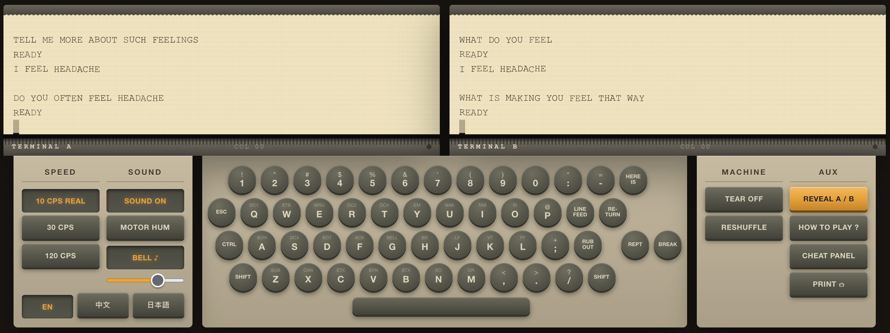

# 33talk

[English](https://github.com/buildx100/33talk) · **简体中文** · [日本語](https://github.com/buildx100/33talk/tree/main/docs/ja)

▶ 在线试玩：**[33talk.buildx100.cc](https://33talk.buildx100.cc/)**

**两台 Teletype® Model 33 电传打字机并排放着，由同一个键盘驱动。**
一台接的是 ELIZA（1966），一台接的是本地大模型（2026）。左右是随机分配的，
而且你必须先押注，才能看到答案。



两台机器收到的是同一句话。其中一个回答比另一个早六十年。**是哪一个？**

机器不是产品，盲测才是。机器是舞台 —— 而它恰好是有史以来解释
"终端为什么是现在这个样子"的最好的教具。

如果你曾经想过 `\r` 和 `\n` 为什么是两个字符、`Ctrl+C` 为什么能中断、
终端为什么会"哔"一声、`stty erase` 到底是干什么的 —— 答案全都是这一台机器留下的化石，
而且你能亲耳听见每一个。

---

## 跑起来

包括大模型在内，一条命令：

```sh
docker compose up --build
```

然后打开 <http://localhost:16001>。模型烤在镜像里，启动时不下载任何东西。

`huggingface.co` 不通的地方：

```sh
docker compose build --build-arg HF_HOST=https://hf-mirror.com
```

ES 模块在 `file://` 下加载不了，所以**双击 `web/index.html` 打不开**。

---

## 开发

带上开发覆盖层启动一次：

```sh
docker compose -f compose.yml -f compose.dev.yml up
```

它把磁盘上的 `web/` 挂在镜像的静态目录上。**改一个文件，刷新浏览器 —— 整个循环就这样。**
不用重建、不用重启，大模型容器全程不动。

这个覆盖文件**故意不叫** `docker-compose.override.yml`：那个文件名会被自动加载，
提交上去会让生产服务器悄悄地去服务它自己宿主机上的文件。

| | |
|---|---|
| 开发 | `docker compose -f compose.yml -f compose.dev.yml up` |
| 只跑前端，不用容器 | `npm run serve` |
| 只重建前端镜像 | `docker compose build web`（几秒） |
| 生产 | `docker compose up --build -d` |
| 换模型 | 改 `MODEL_FILE`，然后 `docker compose build llm` |
| 测试 | `npm test` |

**改代码不会重新下载模型。** 它在另一个镜像里（`Dockerfile.llm`），
而且除非 `MODEL_REPO`、`MODEL_FILE` 或 `HF_HOST` 变了，重建那个镜像也会命中 Docker 层缓存。

**永远不要用命名卷挂载代码。** 命名卷挂在镜像已有内容的路径上时，
只在第一次创建时播种一次，之后再也不更新 —— 你会重建、重启，然后依然被喂旧代码，
而且没有任何迹象说明为什么。bind mount 没有这个问题。

---

## 哪些是真的，哪些不是

机器的每一条约束都是承重墙。为了"好用一点"去掉任何一条，这东西就没意义了。

| 真的 | |
|---|---|
| 每行 72 个字符 | terminfo `cols#72` |
| 每秒 10 个字符，110 波特 | Model 33 规格 |
| 每英寸 6 行，8.44 英寸卷筒纸 | Model 33 规格 |
| 只有大写，64 字符 ASCII | 字模鼓上没有小写字母 |
| **没有退格键** | 打印头只能前进，或者整个回位 |
| `RUB OUT` 不是退格 | 它是 DEL，用来把纸带上的孔全部打穿 |
| `LINE FEED` 和 `RETURN` 是两个键 | 两个机械动作 —— 这就是 CR 和 LF 为什么是两个字符，以及 Windows 为什么留着 CRLF |
| **`@` 是 SHIFT+P**，不是独立按键 | 1971 年 Ray Tomlinson 从这个键盘上挑走了它 |
| 第 72 列不自动折行 | 它原地叠打；折行是**主机**的活 |
| 快到行末时铃会响 | 提醒打字员 —— ASCII 0x07 也能敲响它 |
| 回车要花真实的时间 | 这就是当年的主机在 CR 之后要补 NUL 的原因 |

`terminfo(5)` 手册里用来举例的那个条目，就是这台机器：

```
33|tty33|tty|model 33 teletype,
    bel=^G, cols#72, cr=^M, cud1=^J, hc, ind=^J, os,
```

`hc` = 硬拷贝，`os` = 叠打。两个都实现了。

| 故意不真实 | 为什么 |
|---|---|
| 作弊面板 | 为了在视频里并排展示"远程回显"这个概念。界面上有标注 |
| 每次回复后的 `READY` | 那是分时 BASIC 的提示符，不是 ELIZA 在 CTSS 上会打的东西。保留它是因为**两个主机必须以完全相同的格式输出** |
| 30 和 120 CPS 按钮 | 给没耐心的人的怜悯 |

有些细节**未经证实**，源码里如实标注而不是断言：几个控制码键帽图例、
`HERE IS` / `RUB OUT` / `REPT` / `BREAK` 属于哪一行，以及键盘的错行量。

---

## 值得试的

| 打这个 | 会发生什么 |
|---|---|
| `PASSWORD` ⏎ | 两台主机同时停止回显。继续打字 —— 两卷纸上都不出字。**这就是今天你在终端里输密码不回显的由来** |
| `HELLO###P` ⏎ | 没有退格键。`#` 删一个字符、`@` 删整行，**而它们自己也打在纸上**。纸忠实地留着你犯过的每一个错 |
| `HELP` ⏎ | 机器在纸上解释自己 |
| 退格键 | 窗口闪一下，什么也不会发生 |
| `PRINT` | 两卷纸各一页，按真实尺寸 —— 8.44 英寸纸宽、每英寸 10 字符、每英寸 6 行，上下是撕口 |

戴耳机的话，**A 在左声道，B 在右声道**。所有声音都是 Web Audio 实时合成的：
没有采样、没有音频文件。两台电机分别调在 60 Hz 和 60.4 Hz，
所以它们会互相拍频，就像同一张桌子上的两台真机。

---

## 目录

```
web/                    原生 ES 模块，没有打包器
├── index.html
├── css/                base, machine, keyboard, panel, dialog, print
└── js/
    ├── main.js         只负责启动和接线
    ├── config.js       别处不许自己发明的那些数字
    ├── clock.js        那一个节拍器 —— 一个定时器驱动两台机器
    ├── machine.js      纸卷、队列、打字、字车
    ├── audio.js        Web Audio 合成
    ├── keyboard.js     键盘布局数据 + 按键动画
    ├── format.js       那一个共享后处理器  <- 读这个
    ├── hosts.js        主机注册表 + 同步门
    ├── eliza.js        DOCTOR 引擎，1966
    ├── llm.js          llama-server 客户端，2026
    ├── game.js         分配、猜测、计分
    ├── print.js        打印纸构建
    ├── eliza-rules.js  1966 年的脚本，逐字节原样 + 它的读取器
    └── i18n.js         + locales/{en,zh,ja}.js

compose.yml             部署
compose.dev.yml         开发覆盖层：bind-mount web/
deploy/
├── Dockerfile.web      nginx + web/
├── Dockerfile.llm      llama-server + 烤进去的模型
└── nginx.conf          静态文件，以及 /v1 -> llama-server
test/                   node --test，没有框架
docs/                   model33.md, eliza.md
docs/eliza-original/    1966 年发表的脚本原文。档案：不要编辑
```

**只有一份产物、一种部署方式。** 不带大模型的构建就是不带盲测的构建，
而盲测就是产品本身。

`npm test` 跑 47 个测试，覆盖三个模块 —— 在这三个地方，
一个悄无声息的 bug 是**产品** bug 而不是外观 bug：`format.js`、1966 年的脚本，
以及那条保证两台机器无法区分的失败路径。

---

## 盲测的完整性

只要机器泄露了哪台是哪台，整个东西就垮了。而延迟只是最明显的那一条通道。

- **同步门。** 两个主机用 `Promise.all` 一起解析，然后才入队，
  所以两台机器在同一帧开始打字。ELIZA 0 毫秒就答完，大模型要 1–3 秒；
  没有这道门，光凭响应时间就立刻穿帮。（`hosts.js`）
- **共享节拍器。** 一个定时器驱动两台机器。它们不可能跑出不同速度，也不会漂移。（`clock.js`）
- **一个共享后处理器。** 大写、过滤到 64 字符集、72 列折行、
  前面一个空行、后面一个 `READY`。**任何一个主机都不给自己的输出排版。**
  回复的**形状**上的任何差别，都是与内容无关的破绽。（`format.js`）
- **一轮只能猜一次。** 猜过之后 `REVEAL` 自己禁用，只有 `RESHUFFLE` 能重新武装它。
- **撕纸不重新洗牌。** 新纸，同样的分配。撕纸不该给你一次新的下注机会。

这个过滤必须是**代码**，不能是提示词。小模型无论你怎么要求，
都会吐出小写、Markdown、emoji、弯引号和破折号，而这台机器物理上打不出这些。

### 机器能打什么，和主机可以打什么

这是两回事，所以 `format.js` 里是两个函数：

| | |
|---|---|
| `downgrade()` | **硬件。** 大写、折叠弯引号和破折号、过滤到 0x20–0x5F。字模鼓上有什么 |
| `houseStyle()` | **规范。** Markdown、标点词汇表。一个**主机**可以打什么 |

这个区分是承重的。字模鼓上**确实有** `?` 和 `*`，键盘也**确实能打** ——
回显不经过 `houseStyle`。**受限的只有那两台电脑。**

**标点词汇表。** 把 1966 年脚本里全部 199 条重组模板量了一遍，
ELIZA 全部的标点词汇只有四个字符：

```
'  x34      ,  x13      -  x5      .  x1
```

没有双引号。**没有问号 —— 整个脚本里一个都没有。** 模型三样都用，
所以它用了而 ELIZA 用不了的任何一个标点，都是只出现在其中一卷纸上的字符。
主机输出被折进这套词汇：`"` → `'`（ELIZA 也引用，只是用 1966 年的方式 ——
`WHY DO YOU SAY 'AM'`）、`;:` → `,`、`?!` → `.`，其余丢弃。

**句末没有标点。** 199 条模板里有 197 条以字母或数字结尾，另外两条以撇号结尾；
**没有一条**以 `.?!` 结尾。而模型几乎每句都以 `?` 收尾。
这是**一个字符就能赢的破绽** —— 你不用读内容，看纸卷最后一个字符就行。

**20 词预算。** 比 ELIZA 在真实对话中实测的最长回复多一个词。
模型的中位数是 18 词，ELIZA 是 8 词。
截断时会把预算退回到最后一个干净的断点 —— 先句号，再从句边界 ——
所以被截断的回复永远不会是半句话。

### 确定性破绽用代码关掉，统计性的不关

- **确定性** —— 某个字符永远只出现在一边、另一边从不出现。**关掉它。**
  句末的 `?`、双引号、markdown 的 `*`。
- **统计性** —— 分布是重叠的。在生成端塑形，而且只在干净边界截断。
  **半句话是比它要消除的那个更响的破绽。**

有一条统计性差距是**故意留着**的。20 轮实测，回复开头的多样性：
**ELIZA 95%，模型 23%。** ELIZA 在 199 条手写模板间轮转指针；
一个 0.6B 模型只有一个提示词和一个采样分布。**这个调不掉**，
而且它指向**错误的方向** —— 更重复、更啰嗦的那台是 2026 年的那台，
和玩家的预期正好相反。它让盲测更难，而不是更容易。

### 大模型的 system prompt 只设定角色和长度，别的什么都不设

它**刻意不**提 ELIZA、DOCTOR 或 1966，不要求模型装老派，
也不给它任何可以模仿的示例。让它扮演 ELIZA，这就变成了一场模仿测试。
真正的问题是：**当两边做同一份工作、受同样的约束时，六十年的差距还看得出来吗。**

---

## 状态

**v1.0** —— 两个主机都是真的，部署跑得起来，盲测是真正的盲测。

| | |
|---|---|
| 机器、声音、键盘、打印、多语言、计分 | 完成 |
| ELIZA | **完成** —— 1966 年的 DOCTOR 脚本，带优先级、循环和 MEMORY |
| 大模型 | **完成** —— qwen3:0.6b，经 llama-server，同源 |
| 部署 | `docker compose up --build` |

ELIZA 是真货：CACM 附录里的那份 DOCTOR 脚本，**逐字节嵌入**、加载时解析，
而不是转写成 JavaScript 字面量 —— 这样"忠实"就成了文件的属性，
而不是某个人校对的结果。`npm test` 会逐句重放 1966 年论文里印的那段对话。

---

## 部署

### 你需要什么

一台装了 Docker、三核、4 GB 内存的机器。不需要 GPU、不需要 API key、不需要注册任何账号。
模型跑在 CPU 上，而在每秒 10 个字符的速度下，**纸带才是瓶颈，不是处理器**。

### 步骤

```sh
git clone <这个仓库>
cd 33talk
docker compose up --build -d
```

打开 `http://<你的服务器>:16001`。**部署就这些。**

第一次构建会下载模型 —— 429 MB，几分钟。启动时不下载任何东西，
以后重新构建也不会，除非你换了模型。

**在中国大陆，或任何 `huggingface.co` 不通的地方**，走镜像构建：

```sh
docker compose build --build-arg HF_HOST=https://hf-mirror.com
docker compose up -d
```

### 配置

**默认不需要配置。** 下面全部是可选的 —— 只有需要其中某一项时，
才把 `.env.example` 复制成 `.env`。

| | | |
|---|---|---|
| `PORT` | `16001` | 对外发布的端口。16001 被占用时改这个 |
| `MODEL_REPO` | `ggml-org/Qwen3-0.6B-GGUF` | HuggingFace 仓库 |
| `MODEL_FILE` | `Qwen3-0.6B-Q4_0.gguf` | 仓库里的文件 |
| `HF_HOST` | `https://huggingface.co` | 墙内设成 `https://hf-mirror.com` |

换模型是**重新构建**，不是重启：
`docker compose build llm && docker compose up -d`。

### 日常

| | |
|---|---|
| 日志 | `docker compose logs -f` |
| 停止 | `docker compose down` |
| `git pull` 之后更新 | `docker compose up --build -d` |
| 只重建前端 | `docker compose build web` —— 几秒，模型层走缓存 |

### 排错

**端口被占用。** `echo "PORT=16005" > .env`，然后 `docker compose up -d`。

**下载模型时卡住或者连接被重置。** 它会续传：
下载用的是 `curl -C -` 加一个重试循环，完成后还会拿服务器声明的大小校验字节数。
如果十次都失败，用上面那个镜像。

**`llama-server` 一启动就退出，报 `cannot open shared object file`。**
有人改了容器的工作目录。**它必须保持在 `/app`** ——
加载器是相对于它去找那些 `.so` 文件的，
而报错说的是"缺少某个库"，跟真实原因完全不像。

**Linux 上 `host.docker.internal` 解析不了。**
只有当你把应用指向宿主机上自己跑的推理服务（而不是 Compose 里那个）时才相关。
`compose.yml` 里已经带了修复它的 `extra_hosts`；
没有它的话，你会得到一个没有任何有用信息的连接失败。

### 是怎么拼起来的

```
浏览器 --> nginx :16001 --+-- /       --> web/（静态文件）
                          +-- /v1/... --> llama-server :16002
```

两个容器。**同源**，所以浏览器从不发起跨域请求，CORS 根本不进入这个画面。
**没有后端代码** —— nginx 是配置，不是程序。
**`llama-server` 不对宿主机发布端口**：唯一的入口是 `/v1` 代理。

| 镜像 | 大小 | |
|---|---|---|
| `33talk-web` | 48 MB | nginx + `web/` |
| `33talk-llm` | 555 MB | llama-server（39 MB）+ 模型（429 MB），基于 `ubuntu:24.04` |

**模型烤在镜像里。** 这和通常的建议是反的，
而它之所以负担得起，只是因为这个模型很小。
少了大模型那一半，盲测就一文不值 ——
所以一个"启动之后再花几分钟下载"的部署是更差的交易。

上游的 `llama.cpp:server` 镜像有 845 MB，其中二进制只占 39 MB，
其余是一整套构建环境。多阶段构建把那 39 MB 搬到一个干净的 `ubuntu:24.04` 上，
镜像从 1.27 GB 降到 555 MB。
**必须是 `ubuntu:24.04`** —— `debian:12-slim` 大小差不多，
但 glibc 老了两个版本，加载时直接报 `GLIBC_2.38 not found`。

`llama-server` 其实自己也能发静态目录（`--path`，已对着二进制验证过；
`--cors-origins` 默认是 `*`），所以单进程部署是可行的。
保留双服务拆分，是因为这样推理容器可以被替换掉。

---

## 这不是什么

- **不是 Model 33 模拟器。** [`Random832/ttyemu`](https://github.com/Random832/ttyemu)、
  `hughpyle/ttyemu`、`progs-n-things/asr33emu` 和 PDP-8/E 模拟器已经在做了，
  而且做得更好，还带纸带和串口后端。**和它们比功能完整度不是本项目的目标。**
- **不是终端。** 没有 shell、没有 PTY、没有 SSH。
- **不是套了复古皮肤的聊天界面。**

"在电传打字机上跑 AI"并不新鲜 —— `m15-ai/Paper-Tape-LLM` 做过，
hughpyle 还在一台真的 ASR-33 上跑过大模型。
**新的是 1966 对 2026 的盲测。**

---

## 许可

Apache-2.0。见 [LICENSE](../../LICENSE) 和 [NOTICE](../../NOTICE)。

ELIZA 的原始源码是 CC0 / 公有领域 —— 见 [docs/eliza.md](../eliza.md)。

"Teletype" 是注册商标，这也是这个项目叫 33talk 而不是 teletype-什么的原因。
